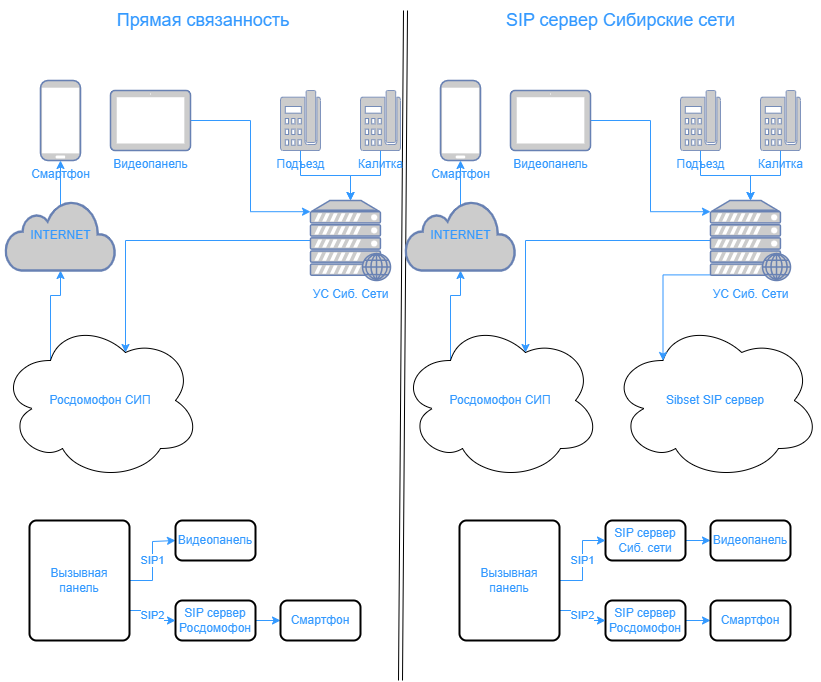

# Тестирование IP видеопанелей для работы в сисетме домофонии ООО "Сибирские Сети"


# Техническое задание:
```
Подключение абонентского монитора к IP-камере вызывного блока Beward. Rubetek. (Получение видео по IP, НЕ АНАЛОГ!!!).

Ожидаемый результат тестирования:

Монитор подключен к IP-камере. Все функции проверены, работают. (Трансляция видео, открывание двери, одновременная работа с приложением Твойдом Сибсети).

Создана инструкция для подключения оборудования техниками ОПиТО.

Составлен список комплектующих необходимых для подключения монитора и для расчета стоимости установки абонентам.
  ```
# Требуемые условия для тестирования:


Требуется воспроизвести на лабороторном стенде сетевые характеристики аналогичные характеристикам на реальном объекте. Для этого требуется:
- Завести в биллинг отдельный объект авторизации с любым произвольным адресом, например: "улица Тестировочная д.1";
- Организовать точку подключения на стенде к абонентскому VLAN, в который обычно подключаем домофонные системы;    
- Произвести коммутацию оборудования на стенде согласно типовым схемам коммутации в жилых домах. Использовать максимально усложненную схему с калиткой и двумя домами с общей связвнностью;

Схемы IP домофонии

