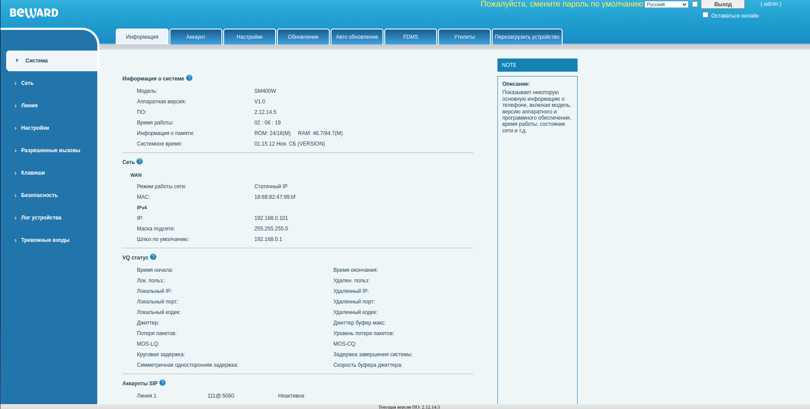
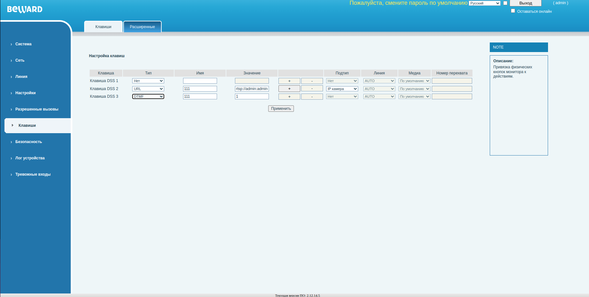
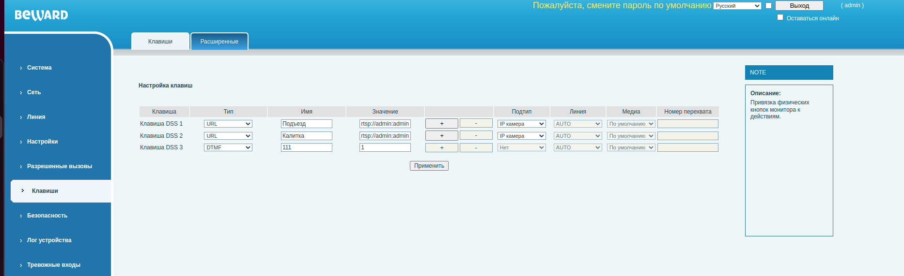
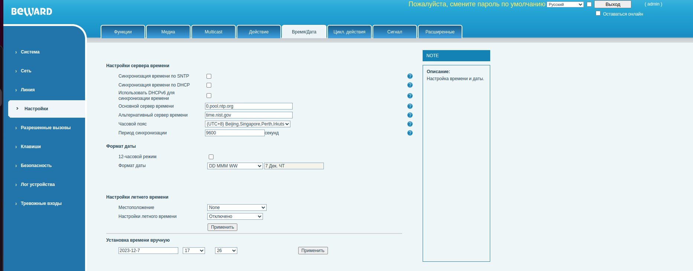

# Инструкция по подключению видеопанели BEWARD SM400w

## Перед выездом

## Требования для подключения

- У абонента на доме должен быть установлен IP видеодомофон Beward, на нем не должен использоваться СИП сервер Сибирских сетей.
- У абонента должен быть наш интернет, иначе придется тянуть отдельную линию от узла до квартиры для подключения видеопанели.

## Что брать с собой

- Видеопаль Beward SM400W
- Блок питания 12в 1а (количество ампер может быть больше), со штекером 5.5 мм. (в компек видеопанели не входит)
- Если у абонента нет розетки рядом с метсом установки видеопанели потребуется сетевой удлинитель или можно удлинить слаботочный кабель от блока питания. Требуется взять все необходимое.
- НОУТБУК, можно конечно выполнить все настройки со смартфона, но это менее удобно.
- Патч корд для подключения видеопанели к роутеру или ноутбуку для первоначальной настройки. 
- Перфоратор и бур на 6 мм., для монтажа видеопанели на стену
- Если у абонента наш интернет и есть вайфай, тогда можно будет подключиться к нему. Если нет, то потребуется тянуть линию до УС, соотвественно нужен будет кабель витая пара 2 или 4 парка и все остальное для его прокладки и подключения.

## Помощь друга

Перед выездом созвониться с коллегами из отдела домофонии уточнить у них: 
- Соответсвуют ли домофония на адресе условиям прописанным выше.
- Уточнить есть ли на адресе калитки с установленными вызывными панелями бивард.
- Сообщить им номер квартиры и абонентский айпи адрес. Попросить прописать их во все видеопанели, установленные на адресе, настройки для видиопанели.
- Попросить их выслать вам RTSP ссылки на видеопотоки с вызывных панелей.
- Попросить быть на связи, для решения возможных проблем.

## Подключение в квартире если у абонента наш интернет и есть WIFI роутер

- Подключаемся к роутеру кабелем или по вайфай. Вайфай пароль можно уточнить у владельца или если он стандартный посмотреть на обратной стороне роутера

- Заходим на веб интерфейс роутера. Пароль также требуется уточнить у абонента, или использовать стандартный. Типовые адреса роутеров 192.168.0.1 192.168.1.1 (часто написано на роутере), или в настройках сети на нотбуке посмотреть шлюз, он и будет являться адресом роутера.

- Подключаем видеопанель BEWARD патч кордом к роутеру.
- Подключаем видеопанель к блоку питания

ДАЛЕЕ все настройки будут продемонстрированны на примере роутера ARCHER C20. На других роутерах веб интерфес может отличаться, придется действовать по аналогии. Не стейсняйтесь спросить совета у друга если что-то не получается.

- Подключаемся к веб интерфейсу роутера. Для этого в браузере вводим адрес роутера и вводим пароль от роутера:

- В интерфесе переходим на вкладку "дополнительные настройки". В ней выбираем СЕТЬ->LAN

- В открывшемся меню смотрим какой адрес получила видеопанель. В списке клиентов должно появиться устройство с именем SM400W. Если в вашем роутере не написаны имена клиентов можно сравнить мак адрес из списка с маком написанным на обратной стороне видеопанели. Запомним этот IP.

## Настройка WI-FI на видеопанели

- Зайдем через браузер в веб интерфейс видеопанели по ее IP адресу (только что его нашли), стандартный логин пароль admin admin

- В первую очередь настроим WIFI подключение. Для этого перейдем в меню Сеть->Настройки Wi-Fi

- Заполним форму "Добавить сеть Wi-fi". В ней необходимо указать имя вайфай и пароль вайфай сети к которой будет подключаться видеопанель. Пример:

- Жмем кнопку "доб.". После проставляем галочку в чекбоксе включить вайфай и жмем применить.

Настройка wi-fi закончена. Теперь необходимо посмотреть какой адрес панель получила от роутера через WIFI. Для этого переходим во вкладку Сеть->основные и в всплывающем списке тип сети вибараем wifi. Ниже должен отобразиться айпи адрес полученный панелью по вайфай, запомним его. С этим адресом будет выполнять все действия далее.

- Отключаем сетевой (интернет) кабель от панели. Пробуем зайти через браузер на веб интерфейс видеопанели по адресу полученному выше.

Далее все действия выполняем для IP адреса присвоенного роутером видеопанели ПО WIFI!!!!!!!!!

- Необходимо зарезервировать полученный по DHCP адрес видеопанели, чтобы он не менялся. Для этого в пункте резервирование адресов нажимаем на "+ добавить"

- В открывшемся списке нажимаем сканировать и добавляем нашу видеопанель плюсиком и нажимаем сохранить.

- Если все сделано верно должна появиться запись в резервировании адресов

- Так как видеопанель будет подключена за NATом роутера требуется пробросить порты 5060 (СИП) и 80 (веб) наружу. Для этого запомним IP адрес нашей панели и перейдем в меню "Переадресация NAT-> виртуальные серверы"

- Добавим два правила для 80 и 5060 порта. Заполняем по аналогии со скрином для 5060:

Имя интерфейса: оставляем как есть

Тип сервиса: Domofon SIP

Внешний порт: 5060

Внутренний IP-адрес: Адрес панели

Внутренний порт: 5060

Протокол: ВСЕ (TCP и UDP)

Нажимаем сохранить

- Добавим правило для 80 порта
Имя интерфейса: оставляем как есть

Тип сервиса: Domofon HTTP

Внешний порт: 8080

Внутренний IP-адрес: Адрес панели

Внутренний порт: 80

Протокол: ВСЕ (TCP и UDP)

Нажимаем сохранить

- Если все прошло как надо у вас должны появиться два правила, как на скрине:

- На этом настройка роутера закончена

## Настройка видеопанели

Вызов с домофона уже должен работать, если коллеги с отдела домофонии настроили вызывную панель. Перейдем к настройки видеопанели:

- Настройка кнопки открывания дверей на видеопанели. На видеопанели beward sm400w по умолчанию не настроены физические кнопки. Настроим кнопку открывания дверей. Для этого заходим в вебинтерфейс видеопанели по айпи адресу. Там выбираем пункт меню Клавиши. В данном меню есть настройки трех физических клавиш видеопанели. Клавиша DSS1 соответствует кнопке с изображением консьержа, DSS2 - кнопке с изображением видеокамеры, DSS3 - кнопке с изображением ключа. Настроим кнопку с изображением ключа DSS3. Поле "тип" выбираем DTMF | поле имя - произвольное значение | поле значение указываем - 1. Пример на скриншоте:

Проверяем функционирование кнопки открытия дверей. Она будет функционировать только при вызове.

## Подключение камер по RTSP

- Получение видео с домофона по нажатию физической кнопки. Как мы уже знаем, по умолчанию на видеопанели Beward sm400w кнопки не настроены. Для настройки отображения камер на видеопанели по нажатию кнопки необходимо зайти в меню "Клавиши". Получение видеопотока с камер наблюдения возможно по RTSP потоку. В меню "клавиши" есть отдельная вкладка "дополнительно" и там отображаются камеры обнаруженные в локальной сети, но подключить камеру при помощи этого меню не получилось. Тех. поддержка дала комментарий что этот функционал полностью не оттестирован и советую заводить камеры по RTSP.

- Настроим видеопанель. Для этого заходим в веб интерфейс видеопанели и переходим во вкладку "Клавиши". Тут необходимо настроить конфигурацию клавиши. Выбираем Тип - URL  Имя - произвольное название   Значение - rtsp ссылка (в случае с вызывной панелью Beward она имеет следующий вид: rtsp://"логин":"пароль"@"ай-пи адрес панели":554/av0_0)     Подтип - IP камера. Если у нас несколько вызывных панелей то видеопоток с каждой из них необходимо прописать на отдельную кнопку. Пример заполнения:

- На этом закончим настройку вызывной панели. Естественно необходимо поменять пароли, не оставлять стандартные, и выставить время. Меню "Настройки" вкладка "Время/дата"

