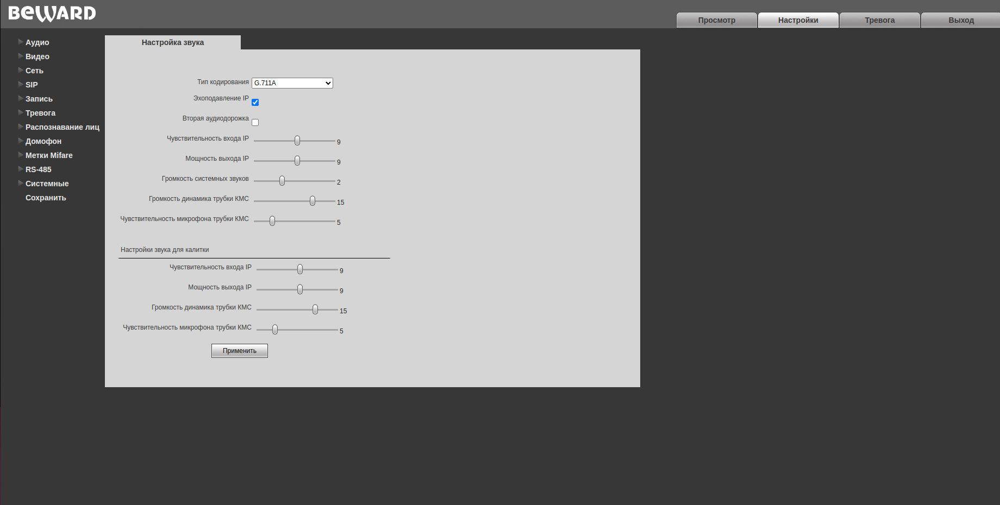
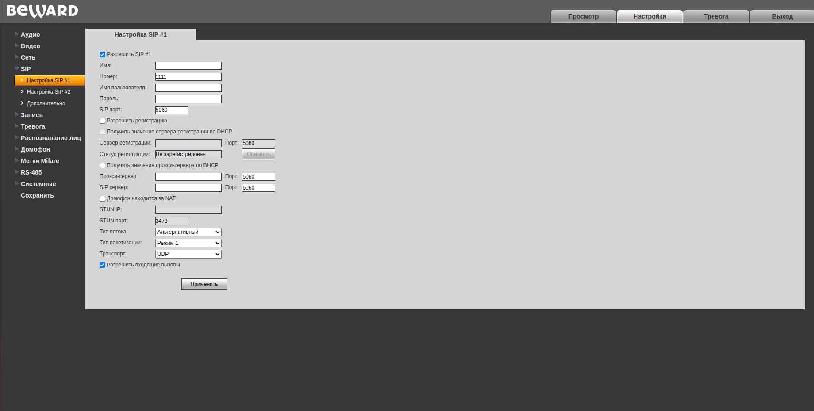
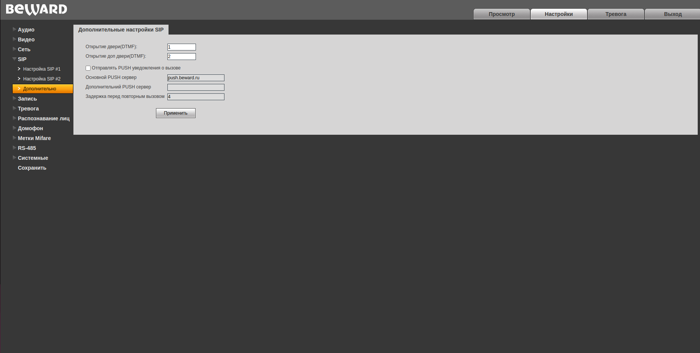

## Настройка вызывной панели 

Beward в своих системах использует ничем не модифицированный протокол SIP 2.0. Для подключения абонентской видеопанели не требуется сип сервер. Необходимо чтобы один из сип аккаунтов на вызывной панели был пустой, но активированный.

Опишем процесс настройки вызывной панели и видеопанели:

- Заходим в веб интерфейс вызывной панели по IP адресу.

- Переходим в меню SIP. В нем есть настройки двух SIP аккаунтов. Один из них будет настроен на соединение с сервером Росдомофона, второй должен быть пустой. Его необходимо активировать при помощи галочки в соответствующем чекбоксе и указать номер в пункте номер, произвольное число, но не должно совпадать с номерами квартир. Пример настройки:

- Далее необходимо в настройках вызывной панели настроить связанность номера квартиры с ip адресом видеопанели установленной в ней. Для этого переходим в меню Домофон->Квартиры. В этом меню ищем настройки квартиры, в которую была установлена видеопанель, в пункте поиск указываем необходимый номер квартиры и нажимаем поиск. Активируем пункт номера для вызова и прописываем в первом ip адрес и сип порт нашей видеопанели. Порт по умолчанию 5060. Пример заполнения:

Если все сделано правильно должен пойти сип вызов на видеопанель. Если вызов не идет проверяем все настройки.

- Настройка кнопки открывания дверей. Открытие дверей осуществляется отправкой тонального сигнала (DTMF) внутри сип сессии. Для начала необходимо определить к какой цифре привязано открытие дверей на вызывной панели. Для этого необходимо зайти в меню SIP->дополнительно на вызывной панели. Там будет указана цифра привязанная к открытию основной двери. Указываем 1.

