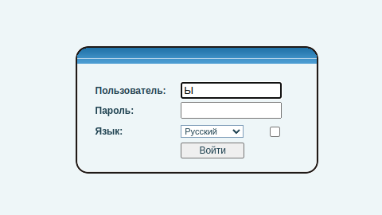
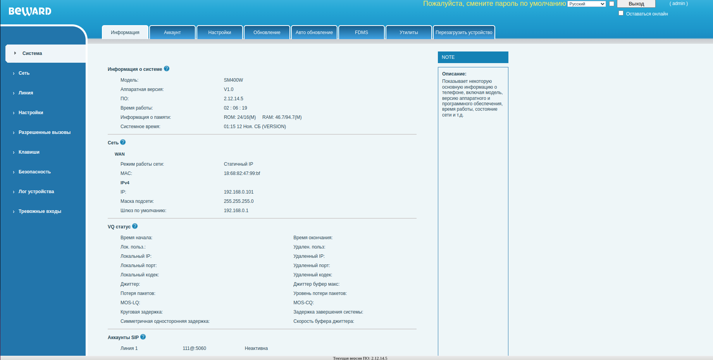
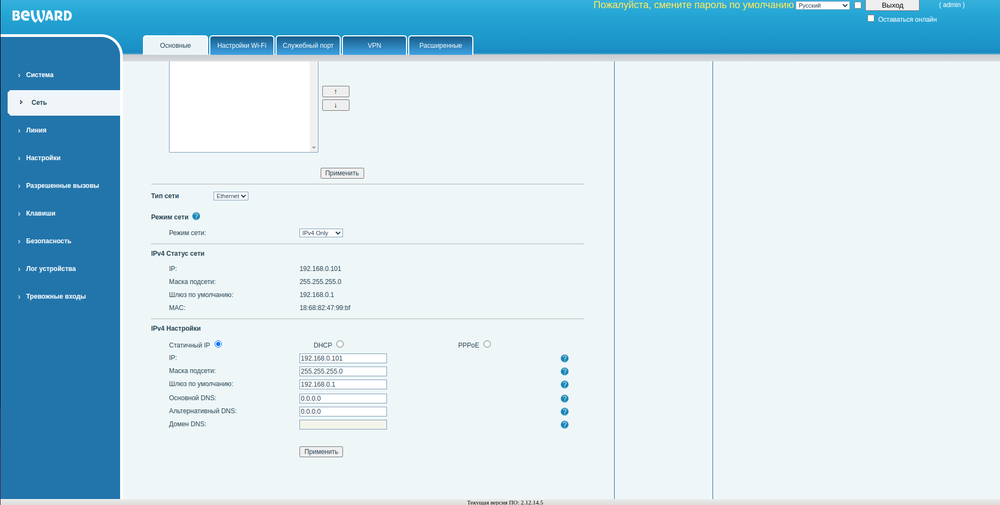
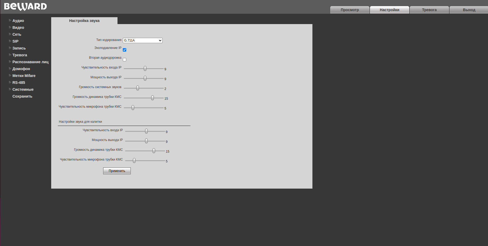
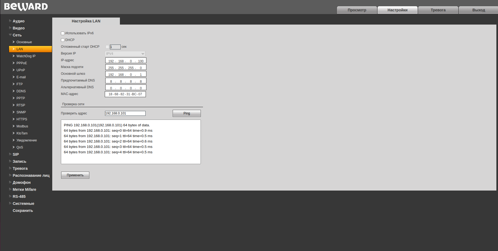
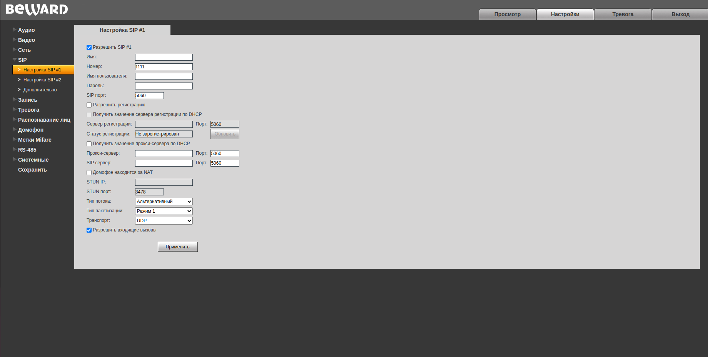
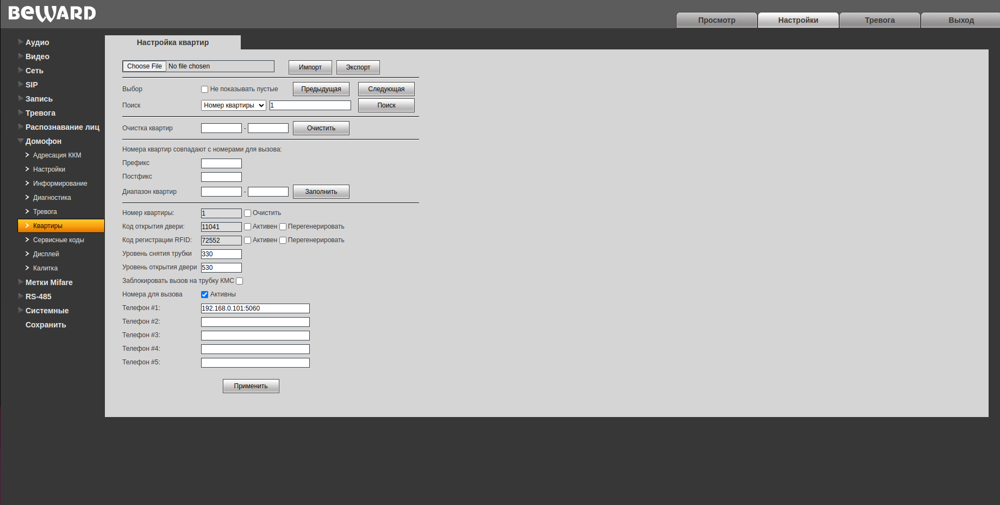
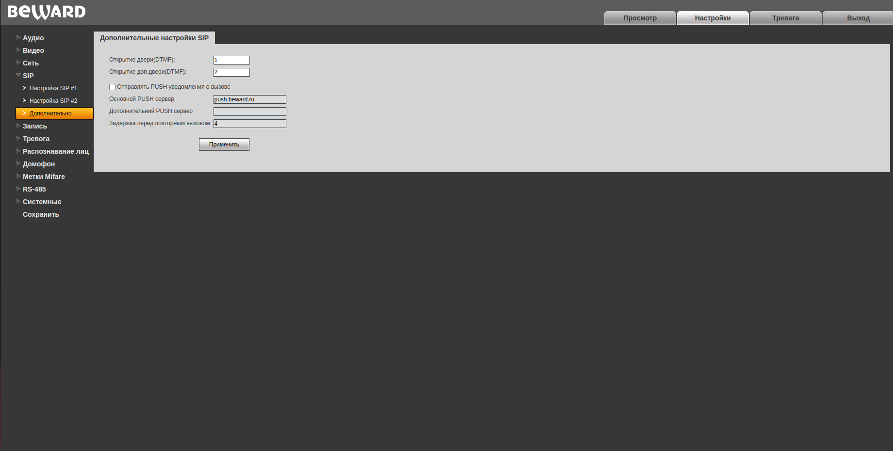
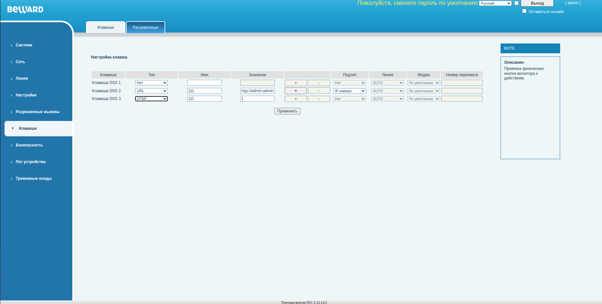

# Тестирование мультимодема Sistematics

## Этапы тестирования

1. [Условия тестеривания](#условия-тестирования)
2. [Тесирование видеопанели Beward SM400W прямая связанность](#тестирование-beward-sm400w) \
   2.1. [Сетевые настройки видеопанели sm400w](#сетевые-настройки-видеопанели) \
   2.2. [Тестирование работы с beward 20211](#тестирование-с-beward-20211)  
   2.3. [Маршрутизация при потере одно из каналов](#потеря-канала) \
   2.4. [Потеря наземного канала](#потеря-наземного-канала) \
   2.5. [Тест загрузки процессора](#тест-загрузки-процессора) \
   2.6. [IP адресация](#ip-адресация) 
3. [Итоги тестирования](#итоги-тестирования)
4. [Возможные варианты использования](#варианты-использования)

## Условия тестирования

Мульти модем (далее ММ) расположен на столе в центре офиса, в трех метрах от 

## Тестирование beward sm400w
Тестируем возможные режимы работы видеопанели Beward SM400w с многоабонентскими вызывными панелями Beward 20211 и Rubitek "vpisat' model'". Тестируем возможность вывода изображения с IP камер видеонаблюдения на видеопанель. 

### Сетевые настройки видеопанели

Видеопанель находится в одной локальной сети с вызывными панелям. Видеопанель имеет Web интерфейс по умолчанию на ней включено DHCP и имеется fallback ip адрес, на случай отсутсвия DHCP сервера. По умолчанию он 192.168.0.99.  

- Страница логина в веб интерфейс вызывной панели.

Логин и пароль по умолчанию: admin admin. Логинимся:

- Главная страница веб интерфейса.

В пункте меню сеть настраиваем статический ip адресс, в нашем случае 192.168.0.101.

- Сетевые настройки.

### Тестирование с beward 20211

Beward в своих системах использует ничем не модифицированный протокол SIP 2.0. Для подключения абонентской видеопанели не требуется сип сервер. Необходимо чтобы один из сип аккаунтов на вызывной панели был пустой, но активированный. На видеопанели никаках настроек кроме настройки ip адреса не требуется. Опишем процесс настройки вызывной панели и видеопанели:

- Заходим в веб интерфейс вызывной панели по IP адресу.

- Переходим в меню Сеть->LAN. Проверяем есть ли сетевая связанность с видеопанелью. Для этого в окне "проверить адрес" вводим айпи адрес виеопанели и нажимаем PING

Пинг должен проходить, если нет тогда необходимо проверить сетевые настройки видеопанили и вызывной панели и убидиться что они находятся внутри одной локальной сети.

- Переходим в меню SIP. В нем есть настройки двух SIP аккаунтов. Один из них будет настроен на соединение с сервером Росдомофона, второй должен быть пустой. Его необходимо активировать при помощи галочки в соотвествующем чекбоксе и указать номер в пункте номер, произвольное число, но не должено совпадать с номерами квартир. Пример настройки:

- Далее необходимо в настройках вызывной панели настроить связанность номера квартиры с ip адресом видеопанели установленной в ней. Для этого переходим в меню Домофон->Квартиры. В этом меню ищем настройки квартиры, в которую была установлена видеопанель, в пункте поиск указываем необходимый номер квартиры и нажимаем поиск. Активируем пункт номера для вызова и прописываем в первом ip адрес и сип порт нашей видеопанели. Порт по умалчанию 5060. Пример заполнения:

Если все сделано правильно должен пойти сип вызов на видеопанель. Если вызов не идет проверяем все настройки.

- Настройка кнопки открывания дверей. Открытие дверей осуществляется отправкой тонального сигнала (DTMF) внутри сип сессии. Для начала необходимо определить к какой цифре привязано открытие дверей на вызывной панели. Для этого необходимо зайти в меню SIP->дополнительно на вызывной панели. Там будет указана цифра привязанная к открытию основной двери, запомним ее.

- Настройка кнопки на видеопанели. На видеопанели beward sm400w по умолчанию не настроены физичесие кнопки. Настроим кнопку открывания дверей. Для этого заходим в вебинтерфейс видеопанели по айпи адресу. Там выбираем пункт меню Клавиши. В данном меню есть настройки трех физичиских клавиш видеопанели. Клавиша DSS1 соответсвует кнопке с изображением консъержа, DSS2 - кнопке с изображением видеокамеры, DSS3 - кнопке с изабраженим ключа. Настроим кнопку с изображением ключа DSS3. Поле "тип" выбираем DTMF, поле имя - произвольное значение, значение указываем - ту цифру, которую мы запомнили в предыдущем пункте. Пример на скриншоте:

Проверяем функционирование кнопки открытия дверей. Она будет функционировать только при вызове. 

- Получение видео с домофона по нажатию физичечкой кнопки. 

### Агрегация

Тестируем скриптом предоставленным Sisitematiks. В нем проведена замена сервера iperf на наш сервер. Скрип тестирует скорость до сервера отдельно через каждый модем и через агрегированный канал. Выводит информацию о процентной разнице между математической суммой скорости через модемы и агрегированным каналом.

- TCP тест Download тест iperf.

- TCP тест Upload тест iperf.

Спустя несколько дней...

- TCP тест Download тест iperf.

- TCP тест Upload тест iperf.

**== Вывод ==**

При тестировании входящего канала виден небольшой прирост скорости и то, что агрегация работает, хоть и не совсем так как математически возможно. При тестирование исходящего канала прирост замечен не был, наоборот скорость агрегированого канала оказалось ниже, чем способен предоставить отдельно один модем.
При повторном тестировании, через несколько дней, было выявлено значительное улучшение работы канала агрегации. Он начал работать практически в соответствии с математическим значением.  

### Потеря наземного канала

В этом разделе тестируем поведение ММ при потере наземного канала.

При первичном тестирование обнаружили, что после восстановления наземного линка маршруты не перестравались на него до перезагрузки роутера. О чем было сообщено инженерам систематикаса. От них получили ответ:

\> *Добрый день!
Если статику прописать всё будет работать.
Я кажется понимаю в чем бага.
У вас на свиче же включен STP?
 Думаю порт переходит в состояние Forwarding уже после того как от MM отправляет 3 request DHCP, а у нас получает потому, что порт на свиче включен сразу.
Не выключайте пока ММ пожалуйста, мы на нем протестируем🙂*

После проведения работ инженерами систематикс, мы возобновили тестирование потери наземного канала.

- Замерим скорость при подключенном наземном канале (downlink, uplink).

Потеря скорости подтверждается спидтестом.

Инженеры были проинформированы про потерю скорости при работе через наземный канал.

- Запустили тест iperf3 до СРВ, на 21 секунде отключаем наземный канал

- На 75 секунде ММ переключился на работу через Симкарты 

- На 95 вернули наземный канал, на 125 трафик пошел через него  

**== Вывод ==**

На переключение с наземного канала на резервный (4G) ММ потребовалось около 50 секунд. На переключение обратно на наземный канал 30 секунд.

### Тест загрузки процессора

Провели тестирование загрузки процессора. При одновременном запуске разного количества потоков получены следующие результаты : 
 - 128 потоков

 - 64 потоков

 - 32 потока

 - 16 потоков

 - 8 потоков

 - 1 поток
 
 - В простое
 

 **== Вывод ==**

 С обработкой большого количества потоков устройство справляется нормально.

### IP адресация

Внешний ip адрес устройства оставался неизменным при отключение и подключении обратно разных операторов связи. Устройство выходит во внешнюю сеть через белый айпи адрес сервера агрегации систематикс. Так как в режиме агрегации поднят тунель до сервера агрегации.

 - Информация с 2IP
 
 - Traceroute яндекса
 

 ## Итоги тестирования

 В качестве устройства для резервирования наземного канала использование не рекомендуется, ввиду долгого (в районе 30с) переключения при падении канала, а также наличии ограничения скорости наземного канала до 10мб\с в следствии ошибки в прошивке устройства.
 В качестве устройства для агрегации трафика с нескольких сим-карт использование данного устройства выглядит нецелесообразно, ввиду дороговизны данного решения, относительно получаемого результата. Агрегация происходит, но происходит нестабильно, периодически наблюдаются существенные просадки скорости, относительно математической суммы трафика со всех сим-карт.
 В целом, основной техический минус данного решения, нестабильная работа, в следствии "сырой" прошивки и отстутствии функционального пользовательского интерфейса (сайт для мониторинга тоже еще не доработан).

Плюсом данного устройства является то, что в отличии от обычного модема 4g, оно позволяет работать с VLAN.

Из положительных сторон можно выделить сервис производителя, техподдержка в режиме "онлайн" готова помочь с любыми возникающими при эксплуатации проблемами. После исправления техподдержкой систематкса выявленных проблем в работе  устройства режим агрегации начал работать хорошо, канал начал работать на 85% от математически рассчитаного.
 
  ## Варианты использования

   - Экстренное восстановление связи ключевым клиентам, при проблемах с восстановлением основного канала связи.
   - Подключение клиентов в местах где нет техничесокой возможности подклчения через иные каналы связи.
   - Подключение удаленных адресов клиентов в общую локальную/vlan сеть
