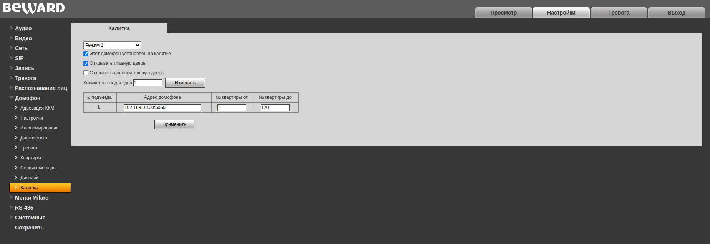

# Тестирование мультимодема Sistematics

## Этапы тестирования

1. [Условия тестеривания](#условия-тестирования)
2. [Тесирование видеопанели Beward SM400W прямая связанность](#тестирование-beward-sm400w) \
   2.1. [Сетевые настройки видеопанели sm400w](#сетевые-настройки-видеопанели) \
   2.2. [Тестирование работы с beward 20211](#тестирование-с-beward-20211)  
   2.3. [Маршрутизация при потере одно из каналов](#потеря-канала) \
   2.4. [Потеря наземного канала](#потеря-наземного-канала) \
   2.5. [Тест загрузки процессора](#тест-загрузки-процессора) \
   2.6. [IP адресация](#ip-адресация) 
3. [Итоги тестирования](#итоги-тестирования)
4. [Возможные варианты использования](#варианты-использования)

## Условия тестирования

Мульти модем (далее ММ) расположен на столе в центре офиса, в трех метрах от 

## Тестирование beward sm400w
Тестируем возможные режимы работы видеопанели Beward SM400w с многоабонентскими вызывными панелями Beward 20211 и Rubitek "vpisat' model'". Тестируем возможность вывода изображения с IP камер видеонаблюдения на видеопанель. 

### Сетевые настройки видеопанели

Видеопанель находится в одной локальной сети с вызывными панелям. Видеопанель имеет Web интерфейс по умолчанию на ней включено DHCP и имеется fallback ip адрес, на случай отсутсвия DHCP сервера. По умолчанию он 192.168.0.99.  

- Страница логина в веб интерфейс вызывной панели.

Логин и пароль по умолчанию: admin admin. Логинимся:

- Главная страница веб интерфейса.

В пункте меню сеть настраиваем статический ip адресс, в нашем случае 192.168.0.101.

- Сетевые настройки.

### Тестирование с beward 20211

Beward в своих системах использует ничем не модифицированный протокол SIP 2.0. Для подключения абонентской видеопанели не требуется сип сервер. Необходимо чтобы один из сип аккаунтов на вызывной панели был пустой, но активированный. На видеопанели никаках настроек кроме настройки ip адреса не требуется. Опишем процесс настройки вызывной панели и видеопанели:

- Заходим в веб интерфейс вызывной панели по IP адресу.

- Переходим в меню Сеть->LAN. Проверяем есть ли сетевая связанность с видеопанелью. Для этого в окне "проверить адрес" вводим айпи адрес виеопанели и нажимаем PING

Пинг должен проходить, если нет тогда необходимо проверить сетевые настройки видеопанили и вызывной панели и убидиться что они находятся внутри одной локальной сети.

- Переходим в меню SIP. В нем есть настройки двух SIP аккаунтов. Один из них будет настроен на соединение с сервером Росдомофона, второй должен быть пустой. Его необходимо активировать при помощи галочки в соотвествующем чекбоксе и указать номер в пункте номер, произвольное число, но не должено совпадать с номерами квартир. Пример настройки:

- Далее необходимо в настройках вызывной панели настроить связанность номера квартиры с ip адресом видеопанели установленной в ней. Для этого переходим в меню Домофон->Квартиры. В этом меню ищем настройки квартиры, в которую была установлена видеопанель, в пункте поиск указываем необходимый номер квартиры и нажимаем поиск. Активируем пункт номера для вызова и прописываем в первом ip адрес и сип порт нашей видеопанели. Порт по умалчанию 5060. Пример заполнения:

Если все сделано правильно должен пойти сип вызов на видеопанель. Если вызов не идет проверяем все настройки.

- Настройка кнопки открывания дверей. Открытие дверей осуществляется отправкой тонального сигнала (DTMF) внутри сип сессии. Для начала необходимо определить к какой цифре привязано открытие дверей на вызывной панели. Для этого необходимо зайти в меню SIP->дополнительно на вызывной панели. Там будет указана цифра привязанная к открытию основной двери, запомним ее.

- Настройка кнопки на видеопанели. На видеопанели beward sm400w по умолчанию не настроены физичесие кнопки. Настроим кнопку открывания дверей. Для этого заходим в вебинтерфейс видеопанели по айпи адресу. Там выбираем пункт меню Клавиши. В данном меню есть настройки трех физичиских клавиш видеопанели. Клавиша DSS1 соответсвует кнопке с изображением консъержа, DSS2 - кнопке с изображением видеокамеры, DSS3 - кнопке с изабраженим ключа. Настроим кнопку с изображением ключа DSS3. Поле "тип" выбираем DTMF, поле имя - произвольное значение, значение указываем - ту цифру, которую мы запомнили в предыдущем пункте. Пример на скриншоте:

Проверяем функционирование кнопки открытия дверей. Она будет функционировать только при вызове. 

- Получение видео с домофона по нажатию физичечкой кнопки. Как мы уже знаем, по умолчанию на видеопанели Beward sm400w кнопки не настроены. Для настройки отображения камер на видеопанели по нажатию кнопки необходимо зайти в меню "Клавиши". Получение видеопотока с камер наблюдения возможно по RTSP потоку. В меню "клавиши" есть отдельная вкладка "дополнительно" и там отображаются камеры обнаруженные в локальной сети, но подключить камеру при помощи этого меню не получилось. Тех. поддержка дала комментарий что этот функционал полностью не оттестирован и советую заводить камеры по RTSP. Как выяснилось опытном путем не всякий RTSP поток способна потянуть видеопанель. Если в панели домофона в меню кодирование оставить профайл HIGH то поток не отображается, при изминении профайла на  BASELINE видео начинает отобржаться. Пример настройки вызывной панели Beward:

- Настроим видеопанель. Для этого заходим в веб интерфейс видеопанели и переходим во вкладку "Клавиши". Тут необходимо настроить конфигурацию клавиши. Выбираем Тип - URL	Имя - произвольное название	Значение - rtsp ссылка (в случае с вызывной панелью Beward она имеет следующий вид: rtsp://"логин":"пароль"@"ай-пи адрес панели":554/av0_0)		Подтип - IP камера. Если у нас несколько вызывных панелей то видеопоток с каждой из них необходимо прописать на отдельную кнопку. Пример заполения:

- На этом закончим настройку вызывной панели. Естественно необходимо поменять пароли, не оставлять стандартные, и выставить время. Меню "Настройки" вкладка "Время/дата"

- Протестируем работу видеопанели с двумя вызывными панелями Beward одна из которых установленна на калитке, вторая на подъезде. В данном случае используется "Режим 1" калитка, сип сервер сибирских сетей не задействован. Панель с калитки звонит прямо на подъездную панель. Так как у нас уже была настроена подъездная паенль никаких дополнительных настроек на ней не требуется. Панель установленную на калитке переводим в "режим 1" и прописываем адрес вызывной панели на подъезде. Домофон->Калитка: 

После этого вызовы по железной части будут проходить до абонентов. Для подключения видеопанели требуется так же как и на подъездной панели настроить связанность номера квартиры с айпи адресом установленной в ней видеопанели. Этот процесс уже был описан выше и делается в меню Домофон->Квартиры

После этой настройки вызовы с обеих вызывных панелей будут проходить на видеопанель.

# Боевое тестирование

Условия тестирования:

1) Тестируем сочетание двух вызывных панелей. Первая на калитку, вторая на подъезд;
2) Абонент подключен к УД (Росдомофон) и  IP видеопанели одновременно;
2) Все устройства заведены в офисную сеть;
3) На вызывные панели заведен сервер Росдомофон для УД;

Процесс тестирования

Вызывные панели и видеопанель подключили к коммутатору подключенному к офисной сети. Настроим SIP сервер росдомофона для работы с УД. Для этого пропишим настройки сип сервера росдомофона в вызвных панелях. Вызывные панели бивард имеют возможность настройки одновременно двух сип серверов. Сип 1 занят совершением локальных вызовов на видеопанель, для подключения к росдомофону будем использовать сип 2. Пример настройки: 

- Настройка sip от Росдомофона

Далее необходимо настроить куда будет переадресовывать звонки вызывная панель. Для этого заходим в меню: Домофон->Квартира. В поиске находим необходимую квартиру. Для нее требуется прописать два телефона. Первым телефоном указываем номер квартиры, в нашем случае 1. Сип вызов с этим номер пойдет в Росдомофон. Телефон 2 указываем IP адрес видеопанели.  

- Настройка квартиры

Точно такуюже процедуру требуется проделать с второй вызывной панелью. 

Тестируем вызов в первую квартиру. Вызываю первую квартиру с вызывной панели размешаемой на калитке. Вызов одновременно проходит на видеопанель и в приложение Сиб Сетей. Так же вызов уходит по железной части на вызывную панель размещаемую на подъезде. Задержки между набором номера квартиры и поступлением вызова, что на телефон, что на видеопанель, почти нет (менее 3х секунд). 

Тестирование качественных характеристик работы видеопанели Beward SM400W с вызывными панелями

Время прохождения вызова:

- Вызов доходит до видеопанели примерно за 1 секунду, видео появляется через 3 секунды.  

Открытие дверей:
- Так как команда на открытие дверей передается в тоновом режиме, открыие дверей возможно только после ответа на СИП вызов на видеопанели.
- Команда открытия дверей проходит моментально менее чем за 1 сек.

Видеопоток:

- Видеопанель sm400w оборудована небольшим дисплеем размером 4.3" с разрешением 480x272. В целом данного дисплея достаточно для оценки оперативной обстановки на месте и индетефикации звонящего.
- Видео отображается без задержки.

Аудио поток:

- Двусторонняя аудиосвязь работает.

## Заключение

Использование IP видеопанелей Beward sm400w в системах домофонии построенных на базе вызывных панелей Beward протестированно и не вызывает нареканий. Свой функционал данная панель выполняет. 

Плюсы:

- На данный момент единственная IP вызывная панель способная работать по сип протоколу с вызывными панелями бивард.
- В отличии от аналоговых видеопанелей отображает видео с вызывной панели с которой был совершен вызов.
- Отобржение видео без 

